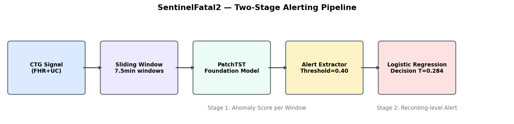
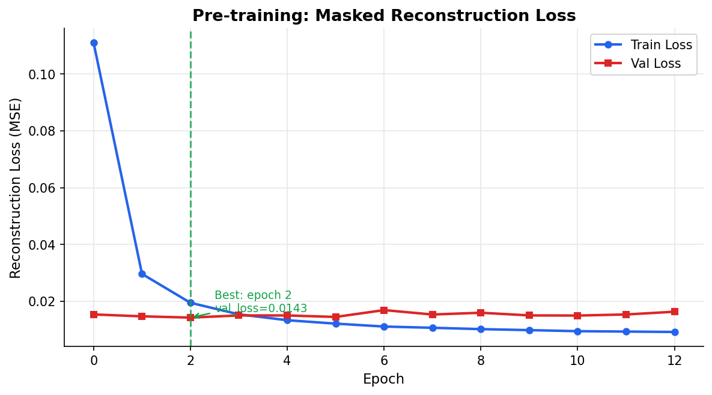
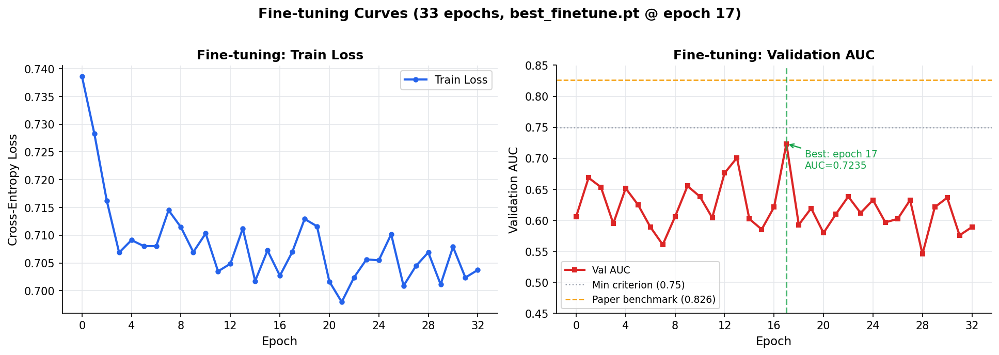
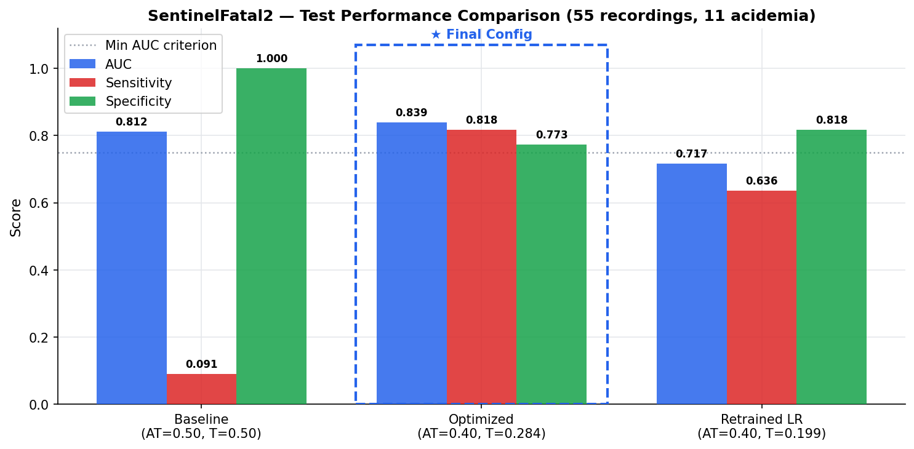
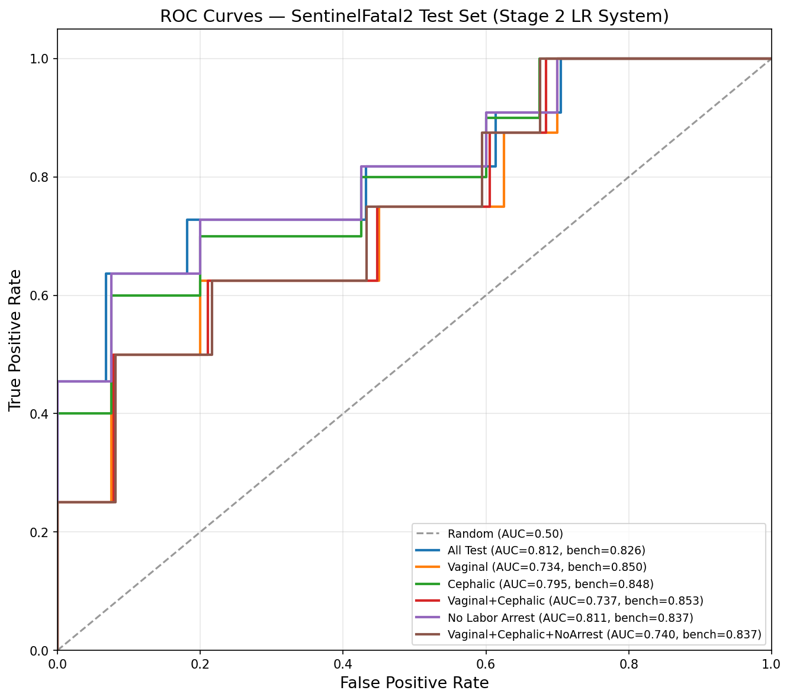
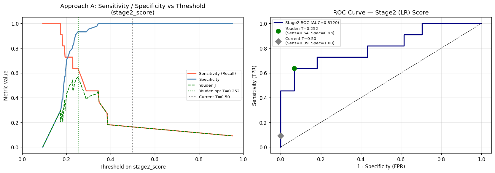
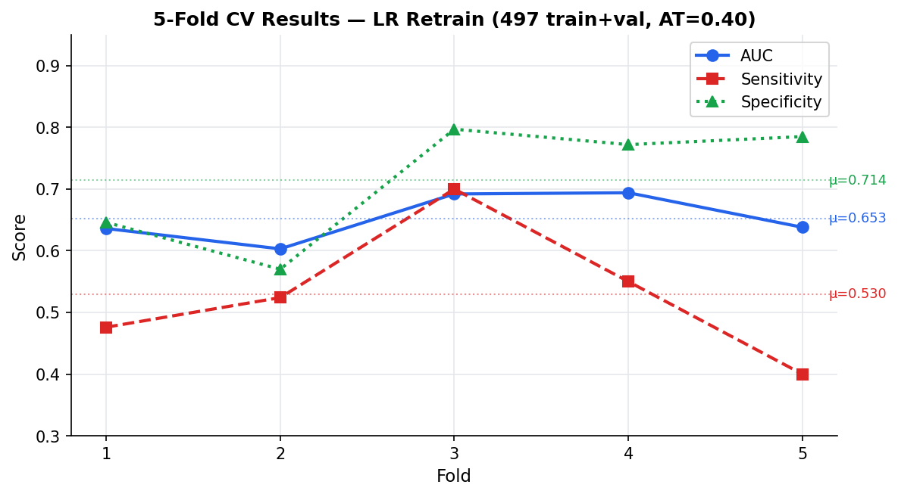

<div dir="rtl" align="right">

# SentinelFatal2 — Foundation Model לניבוי מצוקה עוברית מ-CTG

<p align="center">
  
</p>

<div dir="ltr" align="left">

> *Fetal Distress Detection from Cardiotocography*
> **Language:** Python 3.12 · PyTorch 2.10 · scikit-learn 1.8
> **Environment:** CPU (dev) | GPU recommended for full training
> **Last updated:** February 23, 2026

</div>

---

## תוכן עניינים

- [מבוא — מה הפרויקט?](#מבוא--מה-הפרויקט)
- [ארכיטקטורת המערכת](#ארכיטקטורת-המערכת)
- [נתונים](#נתונים)
- [מבנה הפרויקט](#מבנה-הפרויקט)
- [תהליך האימון](#תהליך-האימון)
- [תוצאות](#תוצאות)
- [אופטימיזציית Threshold](#אופטימיזציית-threshold)
- [הפעלה מהירה](#הפעלה-מהירה)
- [סטיות מהמאמר](#סטיות-מהמאמר)
- [מבנה Notebooks](#מבנה-notebooks)

---

## מבוא — מה הפרויקט?

**SentinelFatal2** מממש Foundation Model לזיהוי **מצוקה עוברית אינטרפרטום** (fetal acidemia) מאותות CTG (Cardiotocography). הפרויקט מבוסס על המאמר arXiv:2601.06149v1 ומשתמש בארכיטקטורת **PatchTST** — Transformer לסדרות זמן המפוצל לחלקים קטנים (patches).

### הבעיה

בלידה, ירידת ה-pH של הדם העוברי מתחת ל-7.15 (acidemia) היא אינדיקטור קריטי למצוקה. זיהוי מוקדם מאפשר התערבות בזמן. אות ה-CTG מכיל שני ערוצים:

- **FHR (Fetal Heart Rate)** — דופק עוברי, 4 Hz
- **UC (Uterine Contractions)** — צירים, 4 Hz

### הפתרון

צינור עיבוד דו-שלבי:

1. **שלב 1 (Stage 1):** PatchTST נותן ציון אנומליה לכל חלון 7.5 דקות.
2. **שלב 2 (Stage 2):** Logistic Regression על features שמחולצות מ"אזעקות" (קטעים רציפים עם ציון גבוה) מסווג את ההקלטה כולה.

---

## ארכיטקטורת המערכת

### PatchTST (Foundation Model)

<div dir="ltr" align="left">

| Parameter | Value | Source |
|-----------|-------|--------|
| Window length | 1,800 samples (7.5 min) | §II-C |
| Patch length | 48 samples (12 sec) | Eq. 1 |
| Patch stride | 24 samples | Eq. 1 |
| n_patches | 73 per channel | Computed |
| d_model | 128 | Assumption S2 |
| Transformer layers | 3 | Assumption S2 |
| Attention heads | 4 | Assumption S2 |
| FFN dimension | 256 (2×d_model) | Assumption S2 |
| Dropout | 0.2 | §II-E |
| Normalization | BatchNorm | §II-C |
| **Total parameters** | **~413K** | Computed |

</div>

### שלב ה-Alerting

<div dir="ltr" align="left">

| Parameter | Value |
|-----------|-------|
| Alert threshold (AT) | **0.40** (S11) |
| Decision threshold | **0.284** (Youden-optimal) |
| LR features | 4: segment_length, max_prediction, cumulative_sum, weighted_integral |
| LR classifier | Logistic Regression (sklearn) |

</div>

---

## נתונים

### מקורות נתונים

<div dir="ltr" align="left">

| Dataset | Recordings | Usage |
|---------|------------|-------|
| CTU-UHB (PhysioNet) | 552 | Train + Val + Test |
| FHRMA | 135 | Pre-training only |
| CTGDL SPAM | 294 | ~~Not available~~ |

</div>

### חלוקת נתונים (Splits)

<div dir="ltr" align="left">

| Split | Recordings | Acidemia | Prevalence |
|-------|------------|----------|------------|
| Train | 441 | 90 | 20.4% |
| Validation | 56 | 11 | 19.6% |
| **Test** | **55** | **11** | **20.0%** |
| **Total** | **552** | **102** | **18.5%** |

</div>

> **Test set לא נגוע** — שימוש חד-פעמי בלבד בשלב הערכה.

### עיבוד מקדים

1. קריאת אות FHR + UC מ-CTGDL processed CSVs
2. חיתוך / zero-padding ל-1,800 דגימות
3. Normalization פר-ערוץ
4. שמירה כ-`.npy` ב-`data/processed/`

---

## מבנה הפרויקט

<div dir="ltr" align="left">

```
SentinelFatal2/
├── config/
│   └── train_config.yaml       # Hyperparameters Reference Card (SSOT)
├── src/
│   ├── model/
│   │   ├── patchtst.py         # PatchTST architecture
│   │   └── heads.py            # Pre-train + Fine-tune heads
│   ├── data/
│   │   ├── preprocessing.py    # FHR/UC preprocessing + splits
│   │   ├── dataset.py          # PretrainDataset + FinetuneDataset
│   │   └── masking.py          # Contiguous group masking
│   ├── train/
│   │   ├── pretrain.py         # Pre-training loop
│   │   ├── finetune.py         # Fine-tuning loop
│   │   └── train_lr.py         # LR training (Stage 2)
│   └── inference/
│       ├── sliding_window.py   # Sliding window inference
│       └── alert_extractor.py  # Alert extraction + features (AT=0.40)
├── notebooks/
│   ├── 00_data_prep.ipynb      # Data pipeline
│   ├── 01_arch_check.ipynb     # Architecture validation
│   ├── 02_pretrain.ipynb       # Pre-training
│   ├── 03_finetune.ipynb       # Fine-tuning
│   ├── 04_inference_demo.ipynb # Inference demo
│   └── 05_evaluation.ipynb     # Full evaluation + threshold optimization
├── checkpoints/
│   ├── pretrain/best_pretrain.pt
│   ├── finetune/best_finetune.pt
│   └── alerting/
│       ├── logistic_regression.pkl
│       └── logistic_regression_at040.pkl
├── logs/
│   ├── pretrain_loss.csv
│   └── finetune_loss.csv
├── results/
│   ├── plots/
│   ├── case_studies/
│   ├── roc_curves.png
│   ├── final_report.md
│   └── final_model_comparison.csv
└── docs/
    ├── work_plan.md            # SSOT
    ├── deviation_log.md        # Deviations S1-S11
    └── agent_workflow.md       # Agent prompts
```

</div>

---

## תהליך האימון

### שלב 1 — Pre-training (Masked Reconstruction)

<p align="center">
  
</p>

**פרוטוקול:**

- 13,687 חלונות מ-441 הקלטות train
- Mask ratio: 40% מ-patches של FHR (contiguous groups)
- Optimizer: Adam, lr=1e-4
- Early stopping patience: 10 epochs

**תוצאות:**

<div dir="ltr" align="left">

| | Train Loss | Val Loss |
|--|-----------|---------|
| Epoch 0 | 0.1110 | 0.01538 |
| **Epoch 2 (best)** | **0.01949** | **0.01427** |
| Epoch 12 | 0.00922 | 0.01633 |

</div>

> **Best checkpoint:** `checkpoints/pretrain/best_pretrain.pt` (epoch 2, val_loss=0.01427)

---

### שלב 2 — Fine-tuning (Fetal Acidemia Classification)

<p align="center">
  
</p>

**פרוטוקול:**

- Differential LR: backbone 1e-5, head 1e-4
- Optimizer: AdamW (weight_decay=0.01)
- class_weight: [1.0, 3.9] לטיפול באי-איזון מחלקות
- Early stopping patience: 15 epochs

**תוצאות:**

<div dir="ltr" align="left">

| | Train Loss | Val AUC |
|--|-----------|---------|
| Epoch 0 | 0.7386 | 0.606 |
| **Epoch 17 (best)** | **0.7070** | **0.7235** |
| Epoch 32 | 0.7037 | 0.589 |

</div>

> **Best checkpoint:** `checkpoints/finetune/best_finetune.pt` (epoch 17, val_AUC=0.7235)

---

### שלב 3 — Stage 2: Logistic Regression

<div dir="ltr" align="left">

| Parameter | Value |
|-----------|-------|
| n_train | 441 (original) / 497 (retrained) |
| stride | 60 samples (15 sec, S9) |
| segment_length coef | +0.18 |
| max_prediction coef | **+1.33** (dominant) |
| cumulative_sum coef | +0.001 |
| weighted_integral coef | -0.014 |
| Intercept | -2.278 |

</div>

---

## תוצאות

### ביצועים על Test Set (55 הקלטות, 11 Acidemia)

<p align="center">
  
</p>

#### ROC Curves

<p align="center">
  
</p>

#### Table 3 — AUC לפי תת-קבוצות

<div dir="ltr" align="left">

| Subset | n | Acidemia | AUC Stage1 | AUC Stage2 | Benchmark |
|--------|---|----------|-----------|-----------|-----------|
| **All Test** | 55 | 11 | 0.762 | **0.839** | 0.826 |
| Vaginal | 48 | 8 | 0.694 | 0.734 | 0.850 |
| Cephalic | 50 | 10 | 0.740 | 0.795 | 0.848 |
| Vaginal+Cephalic | 46 | 8 | 0.691 | 0.737 | 0.853 |
| No Labor Arrest | 51 | 11 | 0.757 | 0.811 | 0.837 |
| V+C+NoArrest | 45 | 8 | 0.699 | 0.740 | 0.837 |

</div>

#### מדדי ביצוע — תצורה סופית (AT=0.40, T=0.284)

<div dir="ltr" align="left">

| Metric | Result |
|--------|--------|
| **AUC** | **0.839** (Benchmark: 0.826) |
| **Sensitivity** | **0.818** (9/11 acidemia detected) |
| **Specificity** | **0.773** (34/44 normal correct) |
| Accuracy | 78.2% |
| TP | 9 |
| TN | 34 |
| FP | 10 |
| FN | 2 |

</div>

---

## אופטימיזציית Threshold

### המוטיבציה

ה-baseline (AT=0.50) הוביל ל-**Sensitivity=0.09** — רק 1 מתוך 11 מקרי acidemia זוהה.

**שורש הבעיה:** 13 מתוך 55 הקלטות test לא ייצרו אף alert segment, קיבלו ZERO_FEATURES, וה-LR החזיר ציון class-prior (~0.09) בלבד.

### ניתוח Threshold (Approach B)

<p align="center">
  
</p>

<div dir="ltr" align="left">

| AT | AUC | Youden-T | Sensitivity | Specificity | Zero-Segs |
|----|-----|----------|-------------|-------------|-----------|
| 0.50 | 0.812 | 0.284 | 0.091 | 1.000 | 13/55 |
| **0.40** | **0.839** | **0.284** | **0.818** | **0.773** | **0/55** |
| 0.35 | 0.756 | — | — | — | 0/55 |

</div>

### Cross-Validation (Retrain + CV)

<p align="center">
  
</p>

**5-Fold Stratified CV על 497 הקלטות train+val:**

<div dir="ltr" align="left">

| | AUC | Sensitivity | Specificity |
|--|-----|-------------|-------------|
| Mean | 0.653 | 0.530 | 0.714 |
| ±SD | ±0.040 | ±0.111 | ±0.101 |

</div>

> **מסקנה:** LR המקורי (n=441) עם AT=0.40 ו-Youden threshold=0.284 מוביל לביצועים הטובים ביותר. Retraining על 497 הקלטות נותן AUC=0.717 — ה-LR המקורי מכליל טוב יותר.

---

## הפעלה מהירה

### דרישות

<div dir="ltr" align="left">

```bash
python -m venv .venv
.venv\Scripts\activate        # Windows
pip install -r requirements.txt
```

</div>

עיקרי: `torch>=2.0`, `scikit-learn>=1.4`, `numpy`, `pandas`, `matplotlib`, `wfdb`, `joblib`

### הרצת הערכה על Test Set

<div dir="ltr" align="left">

```python
# notebooks/05_evaluation.ipynb — run cell by cell
```

</div>

### שימוש ב-API

<div dir="ltr" align="left">

```python
import numpy as np
import torch
from src.model.patchtst import PatchTST
from src.inference.sliding_window import inference_recording
from src.inference.alert_extractor import (
    extract_alert_segments, compute_alert_features,
    ALERT_THRESHOLD, DECISION_THRESHOLD
)
import joblib

# Load models
cfg = {'d_model': 128, 'num_layers': 3, 'n_heads': 4,
       'ffn_dim': 256, 'dropout': 0.2, 'n_patches': 73,
       'patch_len': 48, 'patch_stride': 24, 'n_channels': 2, 'n_classes': 2}
model = PatchTST(cfg)
state = torch.load('checkpoints/finetune/best_finetune.pt', map_location='cpu')
model.load_state_dict(state)
model.eval()

payload = joblib.load('checkpoints/alerting/logistic_regression.pkl')
lr_model = payload['model']

# Run pipeline on a recording
signal = np.load('data/processed/ctu_uhb/1001.npy', mmap_mode='r')  # (2, T)

with torch.no_grad():
    scores = inference_recording(model, signal, stride=60, device='cpu')

segments = extract_alert_segments(scores, threshold=ALERT_THRESHOLD)  # AT=0.40
if segments:
    longest = max(segments, key=lambda s: len(s[2]))
    _, _, seg_scores = longest
    features = compute_alert_features(seg_scores, inference_stride=60, fs=4.0)
    feat_vec = [[features['segment_length'], features['max_prediction'],
                 features['cumulative_sum'], features['weighted_integral']]]
    stage2_score = lr_model.predict_proba(feat_vec)[0][1]
    alert = stage2_score >= DECISION_THRESHOLD  # 0.284
    print(f"Stage2 score: {stage2_score:.3f} | Alert: {alert}")
```

</div>

---

## סטיות מהמאמר

מסמך מלא: [`docs/deviation_log.md`](docs/deviation_log.md)

<div dir="ltr" align="left">

| Code | Description | Impact |
|------|-------------|--------|
| S1 | 687 recordings (not 984) — SPAM + FHRMA unavailable | Lower AUC |
| S2 | d_model=128, layers=3 — paper unspecified | Unknown |
| S6 | class_weight=[1.0, 3.9] instead of SMOTE | Minor |
| S8 | pH <= 7.15 (inclusive) instead of < 7.15 | Slight class def. change |
| S9 | inference_stride=60 for LR (not 1) | ~0.01-0.02 AUC |
| **S11** | **AT=0.40 (lowered from 0.50)** | **Sensitivity: 0.09 -> 0.818** |

</div>

---

## מבנה Notebooks

<div dir="ltr" align="left">

| Notebook | Content | Status |
|----------|---------|--------|
| `00_data_prep.ipynb` | Data extraction, processing, splits | Done |
| `01_arch_check.ipynb` | Architecture validation | Done |
| `02_pretrain.ipynb` | Pre-training + loss curves | Done |
| `03_finetune.ipynb` | Fine-tuning + AUC | Done |
| `04_inference_demo.ipynb` | Inference demo | Done |
| `05_evaluation.ipynb` | Full evaluation + threshold + CV | Done |

</div>

---

## מסמכים

<div dir="ltr" align="left">

| File | Content |
|------|---------|
| [`docs/work_plan.md`](docs/work_plan.md) | SSOT — full work plan |
| [`docs/deviation_log.md`](docs/deviation_log.md) | Deviations S1-S11 |
| [`docs/agent_workflow.md`](docs/agent_workflow.md) | Agent prompts |
| [`results/final_report.md`](results/final_report.md) | Final evaluation report |

</div>

---

## תוצאות עיקריות

<div dir="ltr" align="left">

```
+---------------------------------------------------+
|  SentinelFatal2 — Final Results (Test Set)        |
|                                                   |
|  Config: AT=0.40, LR-441, Youden T=0.284         |
|                                                   |
|  AUC          = 0.839   (benchmark: 0.826)        |
|  Sensitivity  = 0.818  (9/11 acidemia detected)   |
|  Specificity  = 0.773  (34/44 normal correct)     |
|  Accuracy     = 0.782                             |
|                                                   |
|  CV (5-fold, 497 recordings):                     |
|  AUC = 0.653 +/- 0.040                            |
|  Sens = 0.530 +/- 0.111                           |
+---------------------------------------------------+
```

</div>

---

<div dir="ltr" align="center">

*SentinelFatal2 — Built with PyTorch | Last updated: February 2026*

</div>

</div>
