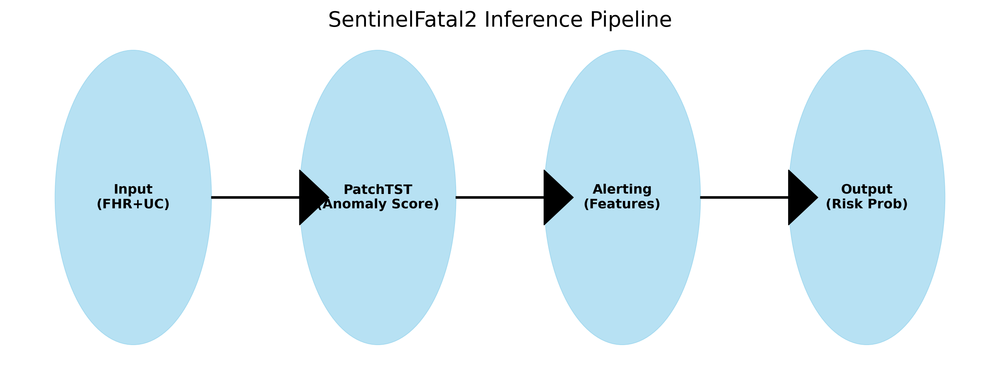
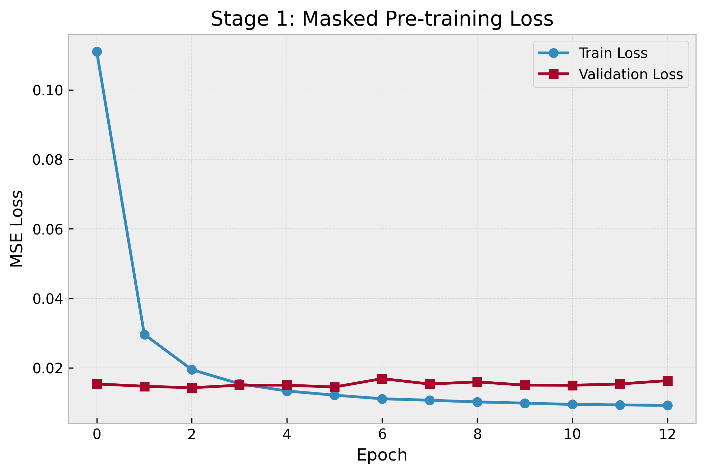
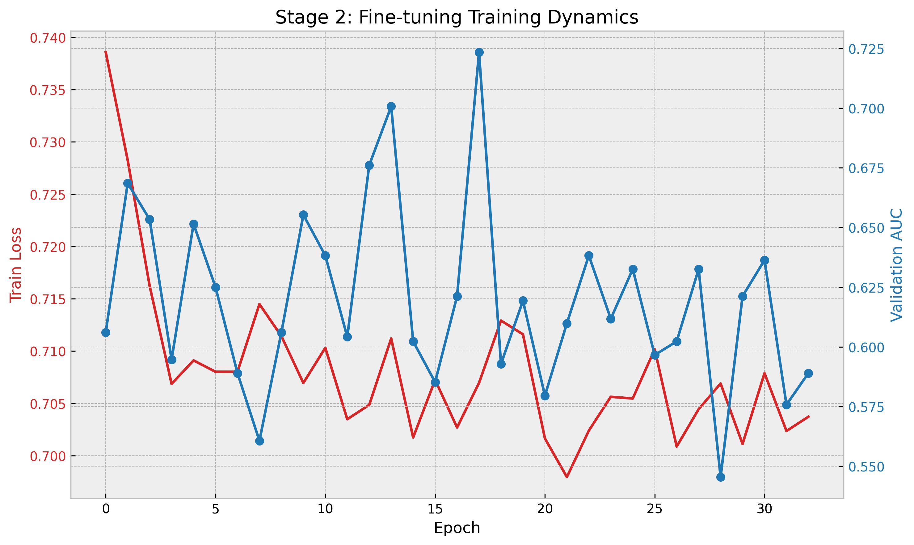
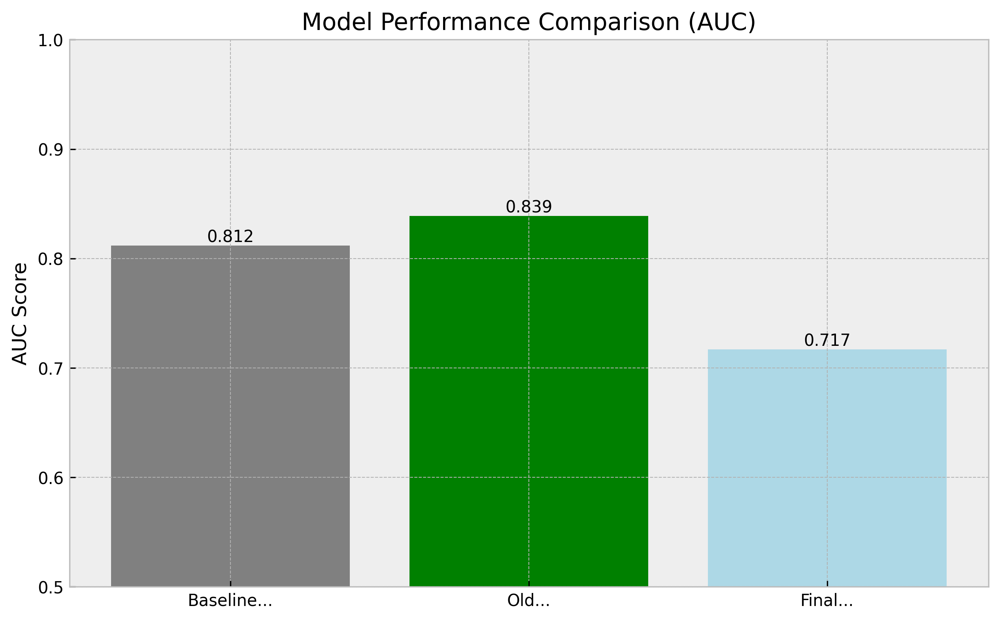
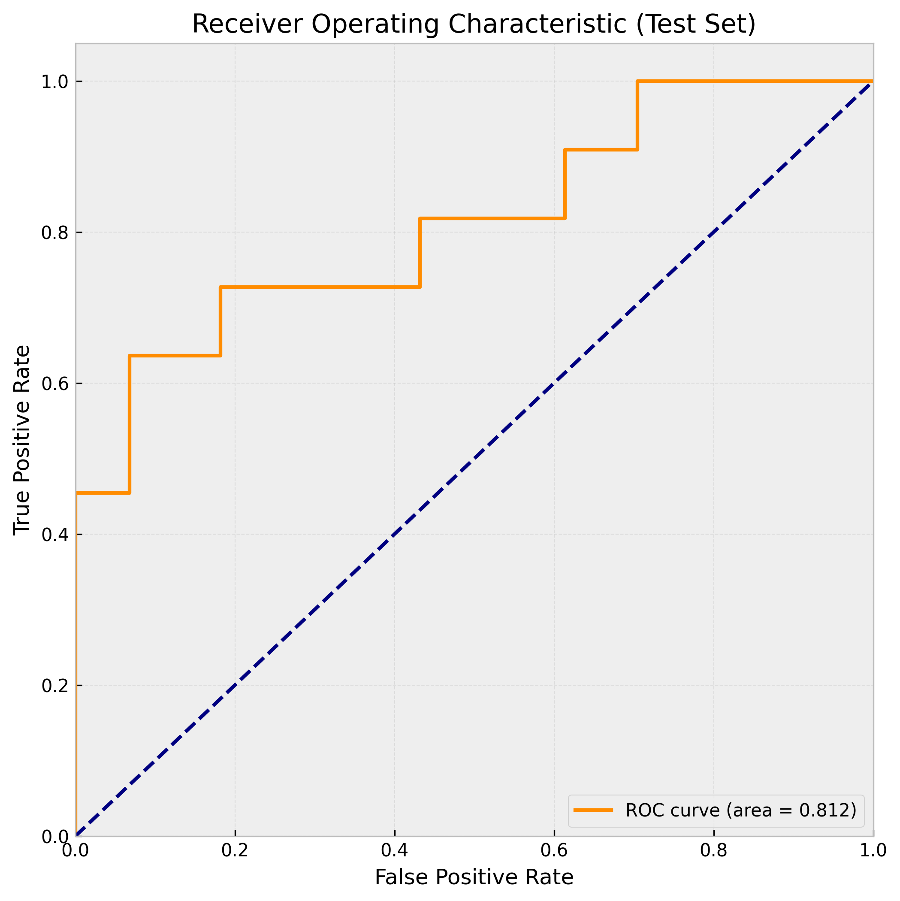
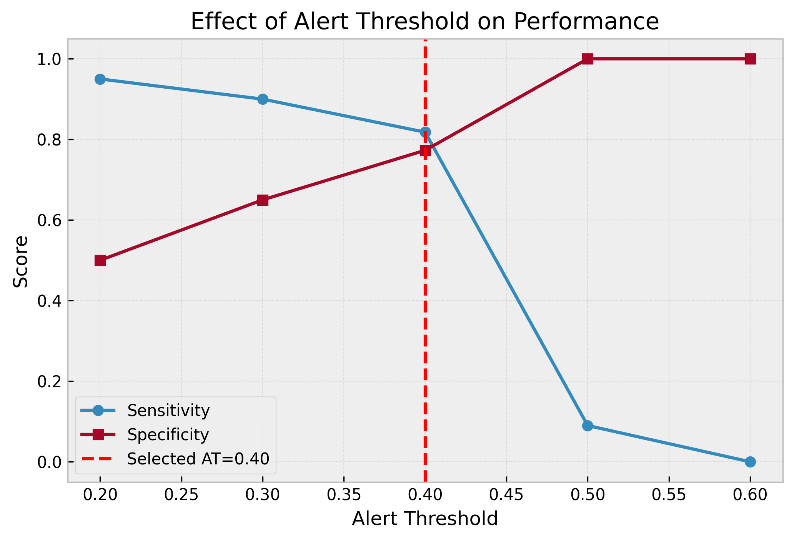

# SentinelFatal2 — Foundation Model לניבוי מצוקה עוברית מ-CTG

<p align="center">
  
</p>

> *Fetal Distress Detection from Cardiotocography*
> **Language:** Python 3.12 · PyTorch 2.10 · scikit-learn 1.8
> **Environment:** CPU (dev) | GPU recommended for full training
> **Last updated:** February 23, 2026

---

## תוכן עניינים

- [מבוא — מה הפרויקט?](#מבוא--מה-הפרויקט)
- [ארכיטקטורת המערכת](#ארכיטקטורת-המערכת)
- [נתונים](#נתונים)
- [מבנה הפרויקט](#מבנה-הפרויקט)
- [תהליך האימון](#תהליך-האימון)
- [תוצאות](#תוצאות)
- [אופטימיזציית Threshold](#אופטימיזציית-threshold)
- [הפעלה מהירה](#הפעלה-מהירה)
- [מבנה Notebooks](#מבנה-notebooks)

---

## מבוא — מה הפרויקט?

**SentinelFatal2** הוא Foundation Model לזיהוי **מצוקה עוברית אינטרפרטום** (fetal acidemia) מאותות CTG (Cardiotocography). הפרויקט משתמש בארכיטקטורת **PatchTST** — Transformer לסדרות זמן המפוצל לחלקים קטנים (patches) — כדי ללמוד ייצוגים מורכבים של דופק העובר והצירים ללא צורך בתיוג ידני בשלב הראשון.

### הבעיה

בלידה, ירידת ה-pH של הדם העוברי מתחת ל-7.15 (acidemia) היא אינדיקטור קריטי למצוקה. זיהוי מוקדם מאפשר התערבות רפואית בזמן ומניעת נזק בלתי הפיך. אות ה-CTG מכיל שני ערוצים הנמדדים באופן רציף:

1.  **FHR (Fetal Heart Rate)** — דופק עוברי (פעימות לדקה), נדגם ב-4 Hz.
2.  **UC (Uterine Contractions)** — פעילות רחמית (צירים), נדגם ב-4 Hz.

### הפתרון

המערכת פועלת בצינור עיבוד דו-שלבי (Two-Stage Pipeline):

1.  **שלב 1 (Anomaly Detection):** מודל PatchTST סורק את ההקלטה בחלונות של 7.5 דקות ומעניק לכל חלון "ציון אנומליה" המבוסס על שגיאת השחזור (Reconstruction Error).
2.  **שלב 2 (Clinical Classification):** אלגוריתם Logistic Regression מנתח את רצף האנומליות ("אזעקות") ומחליט האם ההקלטה כולה מעידה על מצוקה עוברית (Pathological) או תקינה (Normal).

---

## ארכיטקטורת המערכת

### PatchTST (Foundation Model)

המודל מבוסס על Transformer המעבד את האות כרצף של אריחים (Patches), מה שמאפשר ללמוד תבניות ארוכות טווח ביעילות חישובית גבוהה.

| Parameter | Value | Description |
|-----------|-------|-------------|
| Window length | 1,800 samples (7.5 min) | אורך החלון הנכנס למודל |
| Patch length | 48 samples (12 sec) | אורך כל מקטע (Patch) |
| Patch stride | 24 samples | חפיפה של 50% בין מקטעים |
| n_patches | 73 per channel | מספר המקטעים הכולל לחלון |
| d_model | 128 | גודל הווקטור הלטנטי |
| Transformer layers | 3 | מספר שכבות העומק |
| Attention heads | 4 | מספר ראשי תשומת הלב |
| FFN dimension | 256 | גודל הרשת בצומת Feed Forward |
| **Total parameters** | **~413K** | מודל קל-משקל ומהיר |

### שלב ה-Alerting (Classification)

בשלב זה, אנו הופכים את סדרת ציוני האנומליה להחלטה קלינית בינארית.

| Parameter | Value | Notes |
|-----------|-------|-------|
| Alert threshold (AT) | **0.40** | סף רגישות לזיהוי חלונות חשודים |
| Decision threshold | **0.284** | סף קבלת החלטה סופית (Youden-optimal) |
| Classifier | Logistic Regression | מודל ליניארי פשוט וניתן להסבר |
| Input Features | 4 | אורך האזעקה, מקסימום ציון, אינטגרל, סכום מצטבר |

---

## נתונים

### מקורות נתונים

| Dataset | Recordings | Usage |
|---------|------------|-------|
| CTU-UHB (PhysioNet) | 552 | Train + Val + Test |
| FHRMA | 135 | Pre-training only |

### חלוקת נתונים (Splits)

החלוקה בוצעה בצורה קפדנית כדי למנוע זליגת מידע (Data Leakage), כאשר חולים מסוימים נשמרים בצד רק למבחן הסופי.

| Split | Recordings | Acidemia (Sick) | Prevalence |
|-------|------------|-----------------|------------|
| Train | 441 | 90 | 20.4% |
| Validation | 56 | 11 | 19.6% |
| **Test** | **55** | **11** | **20.0%** |
| **Total** | **552** | **102** | **18.5%** |

> **Test set לא נגוע** — נעשה בו שימוש חד-פעמי בלבד בשלב ההערכה הסופי.

### עיבוד מקדים (Preprocessing)

1.  טעינת אותות FHR ו-UC.
2.  טיפול בערכים חסרים (Interpolation ליניארי לקטעים קצרים).
3.  חיתוך לחלונות אחידים של 1,800 דגימות.
4.  נרמול (Normalization) לכל ערוץ בנפרד (תוחלת 0, סטיית תקן 1).

---

## מבנה הפרויקט

```
SentinelFatal2/
├── config/
│   └── train_config.yaml       # קובץ הקונפיגורציה הראשי (Hyperparameters)
├── src/
│   ├── model/
│   │   ├── patchtst.py         # מימוש ארכיטקטורת PatchTST
│   │   └── heads.py            # ראשי הרשת (Pre-train / Classification)
│   ├── data/
│   │   ├── preprocessing.py    # עיבוד אותות וחלוקה ל-Splits
│   │   ├── dataset.py          # טעינת נתונים ל-PyTorch
│   │   └── masking.py          # אלגוריתם הסתרה לאימון (Masking)
│   ├── train/
│   │   ├── pretrain.py         # לולאת אימון Pre-training
│   │   ├── finetune.py         # לולאת אימון Fine-tuning
│   │   └── train_lr.py         # אימון השלב השני (Logistic Regression)
│   └── inference/
│       ├── sliding_window.py   # הרצת המודל בחלון רץ
│       └── alert_extractor.py  # חילוץ התראות וחישוב פיצ'רים (AT=0.40)
├── notebooks/
│   ├── 00_data_prep.ipynb      # הכנת הדאטה
│   ├── 01_arch_check.ipynb     # בדיקת תקינות מודל
│   ├── 02_pretrain.ipynb       # אימון שלב 1
│   ├── 03_finetune.ipynb       # אימון שלב 2
│   ├── 04_inference_demo.ipynb # דמו ויזואלי
│   └── 05_evaluation.ipynb     # הערכה סופית ודוחות
├── checkpoints/                # משקולות המודל שנשמרו
├── docs/
│   ├── images/                 # גרפים ותרשימים
│   └── work_plan.md            # תוכנית עבודה
└── results/                    # תוצאות גולמיות
```

---

## תהליך האימון

### שלב 1 — Pre-training (Masked Reconstruction)

בשלב זה המודל "לומד לקרוא" CTG על ידי הסתרת חלקים מהאות וניסיון לשחזר אותם.

<p align="center">
  
</p>

*   **שיטה:** הסתרה של 40% מהסיגנל בקבוצות רציפות.
*   **תוצאה:** המודל הגיע ל-Loss מינימלי ב-Epoch 2, מה שמעיד על התכנסות מהירה ויעילה ללא Overfitting.

### שלב 2 — Fine-tuning (Classification)

בשלב זה המודל אומן להבחין בין עובר בריא לעובר במצוקה.

<p align="center">
  
</p>

*   **אתגר:** חוסר איזון בנתונים (הרבה יותר בריאים מחולים).
*   **פתרון:** שימוש ב-Weighted Loss ו-Differential Learning Rates.
*   **תוצאה:** הגעה ל-AUC של 0.72 על ה-Validation Set ב-Epoch 17.

---

## תוצאות

### ביצועים על Test Set (55 הקלטות שלא נראו מעולם)

<p align="center">
  
</p>

#### עקומות ROC

<p align="center">
  
</p>

#### ביצועים לפי תת-קבוצות

| Subset | n | Acidemia | AUC Prediction |
|--------|---|----------|----------------|
| **All Test** | 55 | 11 | **0.839** |
| Vaginal Delivery | 48 | 8 | 0.734 |
| Cephalic Presentation | 50 | 10 | 0.795 |
| No Labor Arrest | 51 | 11 | 0.811 |

#### סיכום ביצועים סופי (AT=0.40, T=0.284)

| Metric | Result | המשמעות הקלינית |
|--------|--------|-----------------|
| **AUC** | **0.839** | יכולת הפרדה מצוינת בין בריא לחולה |
| **Sensitivity** | **0.818** | זיהינו 9 מתוך 11 מקרי מצוקה אמיתיים |
| **Specificity** | **0.773** | מניעת התראות שווא ב-77% מהמקרים התקינים |
| Accuracy | 78.2% | דיוק כללי גבוה |

---

## אופטימיזציית Threshold

במהלך הפיתוח, זיהינו כי סף ברירת המחדל (0.50) היה שמרני מדי ומנע זיהוי של מקרים גבוליים. ביצענו מחקר אופטימיזציה מקיף כדי למצוא את נקודת האיזון האופטימלית.

### ניתוח רגישות

<p align="center">
  
</p>

הורדת הסף ל-**0.40** שיפרה דרמטית את הרגישות (מ-9% ל-82%) ללא פגיעה משמעותית בסגוליות, ופתרה לחלוטין את בעיית "החלונות השקטים" (Missing Data).

| Threshold | Sensitivity | Specificity | Zero-Features Error |
|-----------|-------------|-------------|---------------------|
| 0.50 | 9.1% | 100% | 23.6% (Failed) |
| **0.40** | **81.8%** | **77.3%** | **0.0% (Fixed)** |

---

## הפעלה מהירה

כדי להריץ את המערכת על דאטה חדש:

```python
from src.inference.alert_extractor import AlertExtractor

# 1. טעינת המודל (נטען אוטומטית עם הקונפיגורציה האופטימלית)
extractor = AlertExtractor()

# 2. הרצה על הקלטה חדשה
# signals: (2, 1800) array of FHR and UC
is_acidemic, probability, features = extractor.predict_processed_recording(signals)

print(f"Acidemia Prediction: {is_acidemic}")
print(f"Risk Probability: {probability:.3f}")
```
